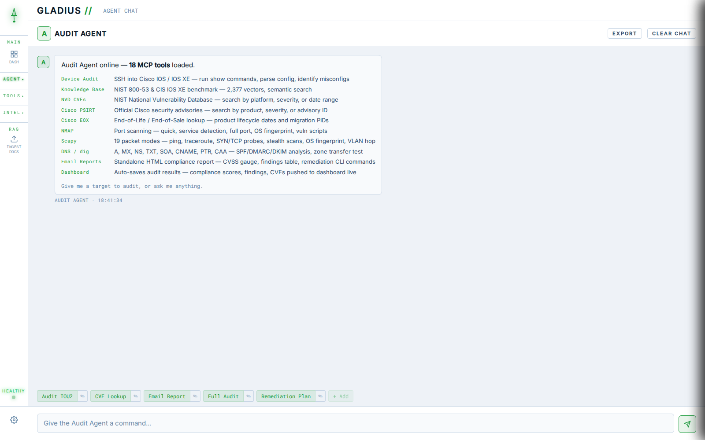
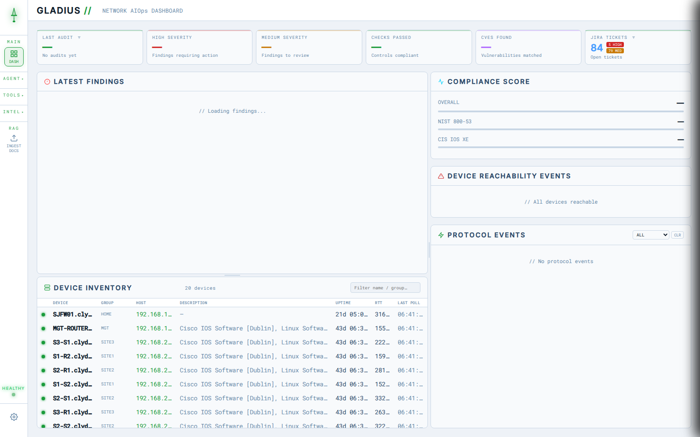
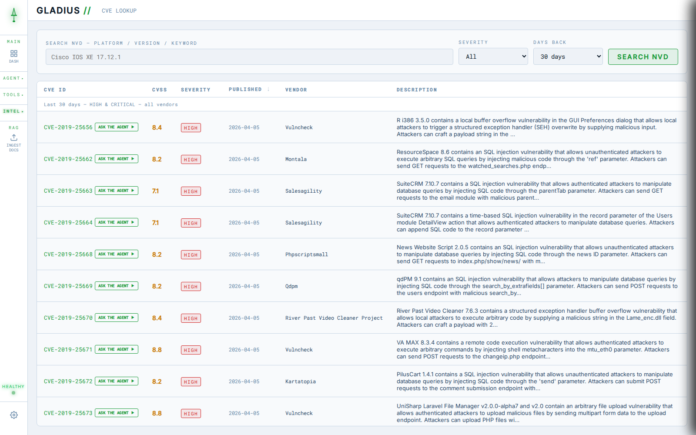
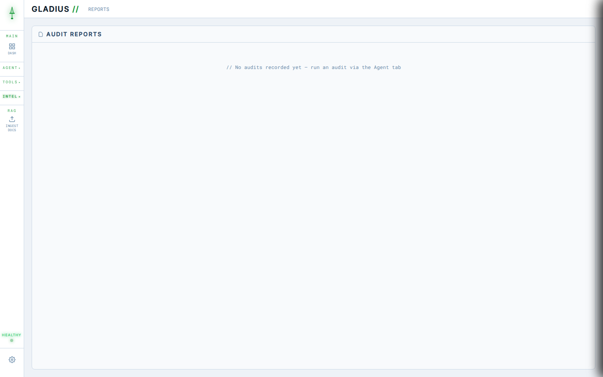

<div align="center">

<!-- Replace with:  -->

# ⚔ GLADIUS

### AI-Powered Cisco Network Security Auditing

*An autonomous security auditor that connects to Cisco devices, runs comprehensive hardening checks, cross-references findings against NIST 800-53 and CIS benchmarks, identifies CVEs, and produces templated compliance reports — all driven by a conversational AI agent.*

[](https://anthropic.com)
[](https://modelcontextprotocol.io)
[](https://fastapi.tiangolo.com)
[](https://docker.com)
[](#)
[](#)

</div>

---

## Screenshots

| Agent | Dashboard |
|---|---|
|  |  |

| CVE Intelligence | Reports |
|---|---|
|  |  |

---

## What It Does

Tell Gladius an IP address. It handles everything else — no scripts to run, no checklists to fill manually.

| Capability | Detail |
|---|---|
| **Autonomous SSH Auditing** | Connects to Cisco IOS / IOS XE devices. Runs show commands, parses output, identifies misconfigurations. |
| **NIST & CIS Knowledge Base** | Findings cross-referenced against a ChromaDB vector store loaded with NIST 800-53 controls and CIS Cisco IOS XE Benchmark guidance. |
| **Live CVE Lookup** | Queries the NIST National Vulnerability Database in real time for the detected IOS version. |
| **Compliance Scoring** | Calculates Overall, NIST 800-53, and CIS compliance scores. Findings bucketed by severity: CRITICAL / HIGH / MEDIUM / LOW / PASS. |
| **Templated HTML Reports** | Standalone HTML reports with compliance gauge, category scorecard, remediation plan with copyable CLI commands, and pre-deployment checklist. |
| **Email Delivery** | Reports emailed as HTML attachments via SMTP. Ask in chat or click the email button — both produce the same templated output. |
| **Audit History** | Last 10 audits stored in the browser. Reports tab shows history across devices with one-click export. |
| **Slack Integration** | Chat with Gladius directly from Slack — DMs or @mentions. Audit results surface as formatted score cards inline. |
| **9 Colour Themes** | Named after Roman gladius variants. Because aesthetics matter. |

---

## Architecture

```
Browser  ──  nginx (web-projects)  ──  index.html
   │                                                Slack
   │  SSE stream / REST                               │
   ▼                                                  │  Socket Mode
gladius-api  (FastAPI :8080)  ◄────────────── gladius-slack (slack-bolt)
   │  Runs Claude claude-sonnet-4-6 with tool use
   │  Intercepts save/email calls, emits SSE events to browser
   │
   │  stdio (MCP protocol)
   ▼
network-audit-mcp  (MCP server)
   │  SSH ──────────────────────► Cisco devices  (Paramiko)
   │  Vector search ─────────────► ChromaDB + MiniLM
   │  CVE lookup ────────────────► NIST NVD API
   │  Email ─────────────────────► SMTP
   └─ save_audit_results ──► POST /api/audit/save ──► SSE ──► browser / Slack

chroma-db  (ChromaDB :8000)
   NIST 800-53 + CIS IOS XE Benchmark vectors
```

### Docker Containers

| Container | Role | Port |
|---|---|---|
| `web-projects` | nginx — serves `index.html` | 80 / 443 |
| `gladius-api` | FastAPI — Claude agent, SSE stream, REST API | 8080 |
| `network-audit-mcp` | MCP server — all tools (SSH, KB, NVD, email) | stdio |
| `chroma-db` | ChromaDB vector store — NIST/CIS knowledge base | 8000 |
| `gladius-slack` | Slack bot — Socket Mode, DMs + @mentions | — |

---

## Audit Flow

```
1. You type "audit 10.0.0.1"

2. Gladius connects via SSH
   └─ Runs show version, show run, show cdp, show snmp, show ntp, show aaa...

3. Findings cross-referenced
   └─ Semantic search against ChromaDB for NIST 800-53 / CIS guidance

4. CVEs identified
   └─ Detected IOS version queried against NIST NVD
   └─ Applicable CVEs added with CVSS scores and advisory links

5. Results saved automatically
   └─ save_audit_results called without prompting
   └─ Dashboard updates instantly via SSE
   └─ Reports tab, findings list, compliance scores all refresh

6. Export or email the report
   └─ Standalone HTML with remediation plan and pre-deployment checklist
```

---

## MCP Tool Reference

| Tool | Purpose |
|---|---|
| `connect_to_device` | SSH into a Cisco device |
| `run_show_command` | Execute any show command on connected device |
| `push_config` | Push configuration commands to the device |
| `disconnect_device` | Close the SSH session |
| `query_knowledge_base` | Semantic search of NIST / CIS ChromaDB collection |
| `query_nvd` | Query NIST NVD for CVEs by IOS version, date, or severity |
| `get_cve_details` | Fetch full details for a specific CVE ID |
| `save_audit_results` | POST findings and scores to the dashboard — called automatically |
| `send_email` | Send report via SMTP as an HTML attachment |
| `run_nmap_scan` | Run nmap against a host with configurable profiles |

---

## Getting Started

### Prerequisites

- Docker + Docker Compose
- Anthropic API key
- SMTP credentials for email reports
- NVD API key (optional but recommended — avoids rate limits)

### Setup

```bash
# Clone the repo
git clone https://github.com/yourusername/gladius.git
cd gladius

# Configure environment variables
cp gladius-api/.env.example gladius-api/.env
cp network-audit-mcp/.env.example network-audit-mcp/.env

# Edit both .env files
nano gladius-api/.env
nano network-audit-mcp/.env

# Start the stack
docker compose up -d

# Open the dashboard
# http://localhost
```

### Environment Variables

**`gladius-api/.env`**

```env
ANTHROPIC_API_KEY=        # Required — Claude API key
CHROMA_HOST=chroma-db
CHROMA_PORT=8000
```

**`network-audit-mcp/.env`**

```env
CHROMA_HOST=chroma-db
CHROMA_PORT=8000
COLLECTION_NAME=network_security_guidelines
EMBED_MODEL=all-MiniLM-L6-v2

NIST_API_KEY=             # Optional — NVD API key

LAB_USERNAME=             # Default SSH username
LAB_PASSWORD=             # Default SSH password

SMTP_SERVER=
SMTP_PORT=587
SMTP_USERNAME=
SMTP_PASSWORD=
SMTP_FROM_NAME=Gladius
DEFAULT_RECIPIENT=

GLADIUS_API_URL=http://gladius-api:8080
```

**`gladius-slack/.env`**

```env
SLACK_BOT_TOKEN=xoxb-...    # Bot token from OAuth & Permissions
SLACK_APP_TOKEN=xapp-...    # App-level token for Socket Mode
GLADIUS_API_URL=http://gladius-api:8080
```

**Slack app scopes required:** `chat:write`, `im:history`, `channels:history`, `app_mentions:read`
**Socket Mode app token scope:** `connections:write`
**Events to subscribe:** `message.im`, `app_mention`

---

## Deployment

```bash
# After changing gladius-api/server.py
docker restart gladius-api

# After changing network-audit-mcp/server.py
docker restart network-audit-mcp
docker restart gladius-api   # always restart API too — refreshes tool cache

# After changing index.html (no restart needed — volume mounted)

# After changing gladius-slack/app.py
docker restart gladius-slack
```

---

## Colour Themes

Nine themes, each named after a variant of the Roman short sword. Switch via the palette icon in the sidebar.

`Gladius` · `Hispaniensis` · `Mainz` · `Fulham` · `Pompeii` · `Spatha` · `Pugio` · `Parazonium` · `Rudis`

---

## File Structure

```
gladius/
├── gladius-api/
│   ├── server.py          # FastAPI app — Claude agent, SSE, all HTTP endpoints
│   └── .env
├── network-audit-mcp/
│   ├── server.py          # MCP server — all Claude tools
│   └── .env
├── gladius-slack/
│   ├── app.py             # Slack bot — Socket Mode, DMs + @mentions
│   ├── Dockerfile
│   ├── docker-compose.yml
│   └── .env
├── web-projects/
│   └── index.html         # Entire frontend — single file, vanilla JS
├── docs/
│   └── screenshots/       # Add screenshots here
├── CLAUDE.md              # Project brief for Claude Code
└── README.md
```

---

## API Endpoints

| Method | Endpoint | Purpose |
|---|---|---|
| `POST` | `/api/chat` | Send message, receive SSE stream |
| `POST` | `/api/audit/save` | Receive structured audit from MCP tool |
| `POST` | `/api/email` | Send pre-built HTML report as attachment |
| `GET` | `/api/health` | Basic health check |
| `GET` | `/api/health/full` | Full component health check |
| `GET` | `/api/kb/stats` | ChromaDB vector count |

---

<div align="center">

**GLADIUS** — AI-Powered Network Security Auditing · Built with Claude · Runs on Docker

</div>
