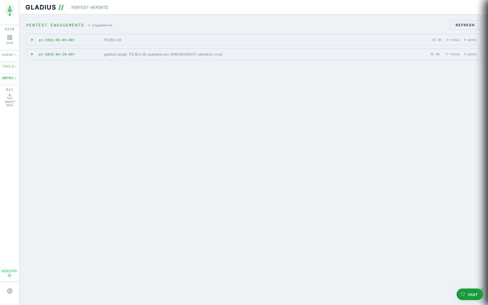
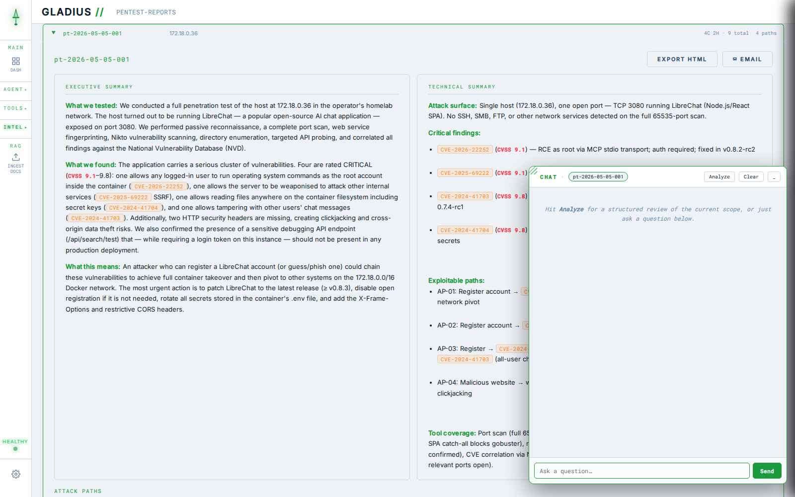

<div align="center">

<!-- Replace with:  -->

# ⚔ GLADIUS

### AI-Powered Cisco Network Security Auditing

*An autonomous security auditor that connects to Cisco devices, runs comprehensive hardening checks, cross-references findings against NIST 800-53 and CIS benchmarks, identifies CVEs, and produces templated compliance reports — all driven by a conversational AI agent.*

[](https://anthropic.com)
[](https://modelcontextprotocol.io)
[](https://fastapi.tiangolo.com)
[](https://docker.com)
[](#)
[](#)

</div>

---

## Screenshots

| Agent | Dashboard |
|---|---|
|  |  |

| CVE Intelligence | Reports |
|---|---|
|  |  |

| PenTest Reports | Local Security Chat |
|---|---|
|  |  |

---

## What It Does

Tell Gladius an IP address. It handles everything else — no scripts to run, no checklists to fill manually.

| Capability | Detail |
|---|---|
| **Autonomous SSH Auditing** | Connects to Cisco IOS / IOS XE devices. Runs show commands, parses output, identifies misconfigurations. |
| **NIST & CIS Knowledge Base** | Findings cross-referenced against a ChromaDB vector store loaded with NIST 800-53 controls and CIS Cisco IOS XE Benchmark guidance. |
| **Live CVE Lookup** | Queries the NIST National Vulnerability Database in real time for the detected IOS version. |
| **Compliance Scoring** | Calculates Overall, NIST 800-53, and CIS compliance scores. Findings bucketed by severity: CRITICAL / HIGH / MEDIUM / LOW / PASS. |
| **Templated HTML Reports** | Standalone HTML reports with compliance gauge, category scorecard, remediation plan with copyable CLI commands, and pre-deployment checklist. |
| **Email Delivery** | Reports emailed as HTML attachments via SMTP. Ask in chat or click the email button — both produce the same templated output. |
| **Audit History** | Last 10 audits stored in the browser. Reports tab shows history across devices with one-click export. |
| **NMAP Scanner** | Agentic nmap scanning with formatted results — headers, tables, highlighted findings. Profiles: quick, service, full port, OS detection, vuln scripts, custom. |
| **Scapy Packet Forge** | Craft and send packets — ICMP ping, ARP scan, traceroute, TCP SYN, Xmas scan, banner grab, DNS query, OS fingerprint, VLAN hop, and more. |
| **pyATS Factory** | LLM-driven pyATS/Genie script generation and execution. 13 built-in templates, Ollama-powered script generation, deterministic or agent analysis output modes. |
| **Gladius Code** | Conversational coding assistant powered by Ollama or Claude. Syntax-highlighted code blocks with copy buttons. |
| **Slack — Audit Bot** | Chat with Gladius directly from Slack — DMs or @mentions. Audit results surface as formatted score cards inline. |
| **Slack — AI Overseer** | Separate Claude agent over Slack with direct access to project files, Docker, and git. Read code, make changes, restart containers, commit — all from Slack. Persistent conversation history across restarts. |
| **Cross-Agent Notifications** | Topbar chips show running tasks across all agents. Toast notifications + nav pulse when jobs complete while on another page. |
| **9 Colour Themes** | Named after Roman gladius variants. Because aesthetics matter. |

---

## Architecture

```
Browser  ──  nginx (web-projects)  ──  index.html
   │                                                      Slack
   │  SSE stream / REST                                     │
   ▼                                        ┌──────────────┴───────────────┐
gladius-api  (FastAPI :8080)  ◄─────────────┤ gladius-slack  (audit bot)   │
   │  Runs Claude claude-sonnet-4-6          │ forwards msgs → /api/chat    │
   │  Intercepts save/email calls            └──────────────────────────────┘
   │
   │  stdio (MCP protocol)                   gladius-overseer  (AI overseer)
   ▼                                          Claude agent — reads/writes files,
network-audit-mcp  (MCP server)               runs docker & git commands,
   │  SSH ──────────────────────► Cisco       persistent history on disk
   │  Vector search ─────────────► ChromaDB
   │  CVE lookup ────────────────► NIST NVD
   │  Email ─────────────────────► SMTP
   └─ save_audit_results ──► POST /api/audit/save ──► SSE ──► browser / Slack

chroma-db  (ChromaDB :8000)
   NIST 800-53 + CIS IOS XE Benchmark vectors
```

### Docker Containers

| Container | Role | Port |
|---|---|---|
| `web-projects` | nginx — serves `index.html` | 80 / 443 |
| `gladius-api` | FastAPI — Claude agent, SSE stream, REST API | 8080 |
| `network-audit-mcp` | MCP server — all tools (SSH, KB, NVD, email) | stdio |
| `chroma-db` | ChromaDB vector store — NIST/CIS knowledge base | 8000 |
| `gladius-pyats` | pyATS Factory — script generation, execution, coder agent | 8090 |
| `gladius-snmp` | SNMP polling service for device inventory | 8000 |
| `gladius-slack` | Slack audit bot — forwards messages to gladius-api | — |
| `gladius-overseer` | Slack AI overseer — Claude with direct project + Docker access | — |

---

## Audit Flow

When you type something like *"audit 192.168.1.1"* in the main chat, exactly one
agent is involved — **Claude (`claude-sonnet-4-6`) inside `gladius-api`**, driven
by the system prompt at `gladius-api/server.py`. Foundation-Sec, the PenTest
agent, and pyATS are **not** called during a normal audit; they're separate
flows. The system prompt enforces a strict 3-phase, max-3-loops structure to
keep audits cheap and predictable.

```
browser  →  gladius-api  →  Claude (loop)  ─┬─→  network-audit-mcp  (stdio, persistent session)
                                            │      └─ SSH / NVD / PSIRT / EOX / ChromaDB / SMTP
                                            └─→  back to itself once findings are ready
```

### Step 0 — trigger
Browser `sendMessage()` POSTs to `/api/chat` and opens an SSE stream. Every
intermediate step the agent takes is streamed back as an event so the UI can
render live activity.

### Phase 1 — single bulk collection (one Claude turn, six tools batched)

Claude returns ONE response containing six `tool_use` blocks; `gladius-api`
executes them in order:

| Tool (`network-audit-mcp/server.py`) | Purpose |
|---|---|
| `connect_to_device` | Paramiko SSH session, kept alive in a global |
| `run_show_command` × `show running-config` | Primary data source — every hardening finding derives from this |
| `run_show_command` × `show version` | IOS / IOS-XE version + platform string |
| `run_show_command` × `show inventory` | Hardware PIDs (for EOX) |
| `run_show_command` × `show ip interface brief` | Interface state overview |
| `disconnect_device` | Closes the SSH session (always batched in the same turn) |

For each tool, the SSE stream emits `tool_start` then `tool_done` so the
browser shows live activity.

### Phase 2 — external intelligence (one Claude turn, four tools batched)

| Tool | What it does |
|---|---|
| `query_knowledge_base` | Semantic search against ChromaDB (NIST 800-53 + CIS IOS XE benchmark, ~2,400 vectors) |
| `query_nvd` | NIST NVD CVE lookup, scoped to the detected IOS version with `cisco_only=True` |
| `query_psirt` | Cisco's official PSIRT openVuln API with the platform string (`ios-xe`, `nx-os`, etc.) |
| `query_eox` | Cisco EOX API — checks every hardware PID for end-of-sale / end-of-support dates |

Large results (`query_nvd`, `query_psirt`, `run_show_command`,
`query_knowledge_base`) are truncated to 20 KB before being fed back to Claude
so context doesn't blow up.

### Phase 3 — synthesise + save (one Claude turn)

Claude reasons over everything in memory and emits a single `save_audit_results`
tool call with:

- `device`, `ip`, `ios`, `timestamp`
- `findings[]` — every check, including PASS entries, with `severity` /
  `category` / `impact` / `fix` / `commands` / `ref` / `cve_id`
- `score{overall, nist, cis}`

Two things happen the moment that call returns:

1. The MCP tool POSTs the JSON back to `gladius-api /api/audit/save` so it
   persists server-side.
2. `gladius-api` directly intercepts the tool input mid-stream and emits an
   `audit_saved` SSE event with the full audit object. The browser writes it to
   `gladius-audit-latest`, appends to `gladius-audit-history`, and refreshes
   the dashboard and Reports tab.

After save, the agent loop is force-broken — no extra Claude turn — so you get
the closing one-liner ("Audit complete — N findings saved") without re-listing
findings.

### Optional follow-on — `send_email`

If you ask Gladius to email the report, Claude calls `send_email`. The API
**intercepts it** and emits a `send_templated_email` SSE event instead of
forwarding to MCP. The browser's `generateReportHTML()` builds the templated
HTML and POSTs it to `/api/email`, which then calls the MCP `send_email` tool
with the rendered HTML as an attachment. This guarantees a properly templated
report rather than Claude's improvised plain-text version.

### SSE events the browser sees during an audit

| Event | When |
|---|---|
| `text` | Claude prose chunks |
| `tool_start` / `tool_done` | Each MCP call begins / ends — drives the live activity bubble |
| `finding` | One per finding, streamed as `save_audit_results` unpacks |
| `audit_saved` | Full audit object — browser persists + refreshes dashboard |
| `send_templated_email` | Browser-side intercept hook for emailed reports |
| `done` / `error` | Stream end states |

### What's *not* called during a normal audit

- **PenTest agent** (`gladius-pentest-mcp` + `/api/pentest/chat`) — separate
  adaptive engagement flow with go-active gating
- **Foundation-Sec / local Security Chat** — only invoked post-hoc from the
  floating widget on the PenTest Reports page
- **gladius-pyats** — only when you launch a pyATS script from the Automation tab
- **NMAP / Scapy / dig** — only if you ask for them explicitly

---

## MCP Tool Reference

| Tool | Purpose |
|---|---|
| `connect_to_device` | SSH into a Cisco device |
| `run_show_command` | Execute any show command on connected device |
| `push_config` | Push configuration commands to the device |
| `disconnect_device` | Close the SSH session |
| `query_knowledge_base` | Semantic search of NIST / CIS ChromaDB collection |
| `query_nvd` | Query NIST NVD for CVEs by IOS version, date, or severity |
| `get_cve_details` | Fetch full details for a specific CVE ID |
| `save_audit_results` | POST findings and scores to the dashboard — called automatically |
| `send_email` | Send report via SMTP as an HTML attachment |
| `run_nmap_scan` | Run nmap against a host with configurable profiles |
| `run_scapy` | Craft and send packets via Scapy with multiple modes |

---

## Getting Started

### Prerequisites

- Docker + Docker Compose
- Anthropic API key
- SMTP credentials for email reports
- NVD API key (optional but recommended — avoids rate limits)

### Setup

```bash
# Clone the repo
git clone https://github.com/yourusername/gladius.git
cd gladius

# Configure environment variables
cp gladius-api/.env.example gladius-api/.env
cp network-audit-mcp/.env.example network-audit-mcp/.env

# Edit both .env files
nano gladius-api/.env
nano network-audit-mcp/.env

# Start the stack
docker compose up -d

# Open the dashboard
# http://localhost
```

### Environment Variables

**`gladius-api/.env`**

```env
ANTHROPIC_API_KEY=        # Required — Claude API key
CHROMA_HOST=chroma-db
CHROMA_PORT=8000
```

**`network-audit-mcp/.env`**

```env
CHROMA_HOST=chroma-db
CHROMA_PORT=8000
COLLECTION_NAME=network_security_guidelines
EMBED_MODEL=all-MiniLM-L6-v2

NIST_API_KEY=             # Optional — NVD API key

LAB_USERNAME=             # Default SSH username
LAB_PASSWORD=             # Default SSH password

SMTP_SERVER=
SMTP_PORT=587
SMTP_USERNAME=
SMTP_PASSWORD=
SMTP_FROM_NAME=Gladius
DEFAULT_RECIPIENT=

GLADIUS_API_URL=http://gladius-api:8080
```

**`gladius-slack/.env`** — audit bot

```env
SLACK_BOT_TOKEN=xoxb-...    # Bot token from OAuth & Permissions
SLACK_APP_TOKEN=xapp-...    # App-level token for Socket Mode
GLADIUS_API_URL=http://gladius-api:8080
```

**`gladius-overseer/.env`** — AI overseer

```env
SLACK_BOT_TOKEN=xoxb-...    # Separate Slack app — bot token
SLACK_APP_TOKEN=xapp-...    # App-level token for Socket Mode
ANTHROPIC_API_KEY=sk-ant-...
```

Both Slack apps require scopes: `chat:write`, `im:history`, `channels:history`, `app_mentions:read`
Socket Mode app token scope: `connections:write`
Events to subscribe: `message.im`, `app_mention`

---

## Deployment

```bash
# After changing gladius-api/server.py
docker restart gladius-api

# After changing network-audit-mcp/server.py
docker restart network-audit-mcp
docker restart gladius-api   # always restart API too — refreshes tool cache

# After changing index.html (no restart needed — volume mounted)

# After changing gladius-slack/app.py
docker restart gladius-slack

# After changing gladius-overseer/app.py
docker restart gladius-overseer

# After changing gladius-pyats/app.py (volume mounted — no cp needed)
docker restart gladius-pyats
```

---

## Colour Themes

Nine themes, each named after a variant of the Roman short sword. Switch via the palette icon in the sidebar.

`Gladius` · `Hispaniensis` · `Mainz` · `Fulham` · `Pompeii` · `Spatha` · `Pugio` · `Parazonium` · `Rudis`

---

## File Structure

```
gladius/
├── gladius-api/
│   ├── server.py          # FastAPI app — Claude agent, SSE, all HTTP endpoints
│   └── .env
├── network-audit-mcp/
│   ├── server.py          # MCP server — all Claude tools
│   └── .env
├── gladius-slack/
│   ├── app.py             # Slack audit bot — forwards to gladius-api
│   ├── Dockerfile
│   ├── docker-compose.yml
│   └── .env
├── gladius-pyats/
│   ├── app.py             # pyATS Factory — script gen, execution, coder agent
│   ├── Dockerfile
│   ├── docker-compose.yml
│   └── .env
├── gladius-overseer/
│   ├── app.py             # Slack AI overseer — Claude with file/docker/git access
│   ├── Dockerfile
│   ├── docker-compose.yml
│   └── .env
├── web-projects/
│   └── index.html         # Entire frontend — single file, vanilla JS
├── docs/
│   └── screenshots/       # Add screenshots here
├── CLAUDE.md              # Project brief for Claude Code
└── README.md
```

---

## API Endpoints

| Method | Endpoint | Purpose |
|---|---|---|
| `POST` | `/api/chat` | Send message, receive SSE stream |
| `POST` | `/api/audit/save` | Receive structured audit from MCP tool |
| `POST` | `/api/email` | Send pre-built HTML report as attachment |
| `GET` | `/api/health` | Basic health check |
| `GET` | `/api/health/full` | Full component health check |
| `GET` | `/api/kb/stats` | ChromaDB vector count |
| `GET` | `/api/automation/models` | List available Ollama + Claude models |
| `POST` | `/api/automation/chat` | pyATS Factory chat (SSE stream via Ollama) |
| `POST` | `/api/automation/coder` | Gladius Code chat (SSE stream via Ollama/Claude) |
| `POST` | `/api/automation/review` | Agent Analysis — stream raw output through LLM |
| `GET` | `/api/automation/scripts` | List saved pyATS scripts |
| `POST` | `/api/automation/scripts/{id}/run` | Execute a saved pyATS script against a device |

---

<div align="center">

**GLADIUS** — AI-Powered Network Security Auditing · Built with Claude · Runs on Docker

</div>
